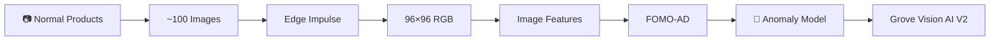
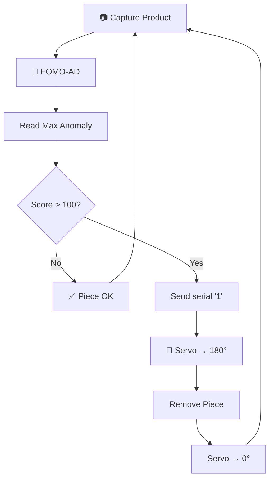

# 🔎 Visual Anomaly Detection — Grove Vision AI Module V2

### Automatic anomaly detection and defective-part removal with Edge Impulse FOMO-AD, Seeed Grove Vision AI V2 and Arduino

[](https://www.edgeimpulse.com/)
[](https://www.seeedstudio.com/Grove-Vision-AI-Module-V2-p-5851.html)
[](https://docs.arduino.cc/hardware/nano/)
[](https://www.python.org/)
[](LICENSE)

**Roni Bandini — Buenos Aires, Argentina — September 2024**

**Visual Anomaly Grove V2** is a compact production-line inspection prototype that detects visual anomalies and automatically removes defective pieces.

A **[Seeed Studio Grove Vision AI Module V2](https://www.seeedstudio.com/Grove-Vision-AI-Module-V2-p-5851.html)** runs an **[Edge Impulse FOMO-AD](https://docs.edgeimpulse.com/docs/capabilities/anomaly-detection/visual-anomaly-detection)** model directly on its WiseEye2 processor.

Inference output is parsed by a Python application. When the maximum anomaly score exceeds the configured threshold, the computer sends a serial command to an **Arduino Nano**, which moves an **SG90 servo arm** and pushes the anomalous piece away from the inspection line.

---

## ✨ Features

* 🔎 Visual anomaly detection
* 🧠 Edge Impulse FOMO-AD
* ⚡ ~1 ms inference on Grove Vision AI V2
* 📷 OV5647 camera
* 🏭 Production-line inspection concept
* 🐍 Python inference parser
* 📊 Parses maximum anomaly score
* ♾️ Arduino Nano actuator controller
* 🦾 SG90 servo rejection arm
* 📦 Edge Impulse deployment package included
* 🌐 Public Edge Impulse project
* 🔌 Small, modular hardware setup

---

# 🏗️ Architecture

```mermaid
flowchart LR
    OBJ["📦 Product"]
    CAM["📷 OV5647 Camera"]
    GROVE["🧠 Grove Vision AI V2"]
    FOMO["Edge Impulse<br/>FOMO-AD"]
    RUNNER["💻 edge-impulse-run-impulse"]
    PY["🐍 anomalyParser.py"]
    SERIAL["USB Serial"]
    NANO["♾️ Arduino Nano"]
    SERVO["🦾 SG90 Servo"]
    REMOVE["↗️ Remove Piece"]

    OBJ --> CAM
    CAM --> GROVE
    GROVE --> FOMO
    FOMO --> RUNNER
    RUNNER --> PY
    PY -->|"Anomaly > threshold"| SERIAL
    SERIAL --> NANO
    NANO --> SERVO
    SERVO --> REMOVE
```



The Machine Learning inference runs on the Grove Vision AI Module V2. The computer only parses the output and coordinates the rejection mechanism.

---

# 🧠 Grove Vision AI Module V2

The project uses the **[Seeed Grove Vision AI Module V2](https://wiki.seeedstudio.com/grove_vision_ai_v2/)**.

| Specification    | Value                    |
| ---------------- | ------------------------ |
| Processor        | Himax WiseEye2 HX6538    |
| CPU              | Dual-core Arm Cortex-M55 |
| AI accelerator   | Arm Ethos-U55            |
| Flash            | 16 MB                    |
| Camera interface | CSI                      |
| Camera           | OV5647-62                |
| Microphone       | PDM                      |
| Storage          | microSD                  |
| USB              | USB-C                    |
| Expansion        | Grove + XIAO             |

The module is designed for MCU-class Computer Vision and supports hardware-accelerated neural-network inference.

Official resources:

👉 **[Grove Vision AI Module V2 — Seeed Wiki](https://wiki.seeedstudio.com/grove_vision_ai_v2/)**

👉 **[Grove Vision AI Module V2 — Product Page](https://www.seeedstudio.com/Grove-Vision-AI-Module-V2-p-5851.html)**

👉 **[Grove Vision AI V2 Kit with OV5647 Camera](https://www.seeedstudio.com/Grove-Vision-AI-V2-Kit-p-5852.html)**

---

# 🧠 Edge Impulse Model

Public project:

👉 **[Visual Anomaly Grove Vision AI Module V2 — Edge Impulse Project #513864](https://studio.edgeimpulse.com/public/513864/live)**

Current public project data:

| Parameter        |                            Value |
| ---------------- | -------------------------------: |
| Images           |                          **102** |
| Training         |                           **95** |
| Testing          |                            **7** |
| Label            |                     `no anomaly` |
| Input            |                  **96 × 96 RGB** |
| Processing       |                            Image |
| Architecture     | MobileNetV2 0.35 + GMM / FOMO-AD |
| Target           |                   Himax WiseEye2 |
| Reported latency |                         **1 ms** |
| Peak RAM         |                         **4 KB** |

FOMO-AD learns what a **normal product** looks like rather than requiring examples of every possible defect.

Training images therefore use:

```text
no anomaly
```

as the main training class.

---

# 🔬 Training Workflow



The original procedure:

1. Capture approximately **100 images** of correct pieces.
2. Use `no anomaly` as the label.
3. Configure a **96×96 RGB Image** impulse.
4. Select **Visual Anomaly Detection**.
5. Use the **FOMO-AD** architecture.
6. Select **Medium capacity**.
7. Train and test.
8. Deploy directly to **Seeed Grove Vision AI Module V2**.

Complete instructions:

👉 **[Visual Anomaly Detection — Grove Vision AI Module V2 — Edge Impulse](https://docs.edgeimpulse.com/projects/expert-network/visual-anomaly-detection-seeed-vision-ai-2)**

---

# 📥 Data Acquisition

Flash the Edge Impulse firmware for the Grove Vision AI V2, then install the Edge Impulse CLI.

Install:

👉 **[Node.js](https://nodejs.org/)**

👉 **[Python](https://www.python.org/)**

Then:

```bash
npm install -g edge-impulse-cli --force
```

Start:

```bash
edge-impulse-daemon
```

Log into Edge Impulse and select the project.

The module can then capture images directly into your Edge Impulse dataset.

Edge Impulse CLI documentation:

👉 **[Edge Impulse CLI Installation](https://docs.edgeimpulse.com/tools/clis/edge-impulse-cli/installation)**

---

# 📦 Deploy the Model

From the Edge Impulse Deployment page choose:

```text
Seeed Grove Vision AI Module V2
```

Build and download the deployment package.

The repository also includes a deployment ZIP:

👉 **[visual-anomaly-grove-vision-ai-module-v2-seeed-grove-vision-ai-module-v2-v8.zip](https://github.com/ronibandini/visualAnomalyGroveV2/blob/main/parser/visual-anomaly-grove-vision-ai-module-v2-seeed-grove-vision-ai-module-v2-v8.zip)**

Flash the generated firmware to the Grove Vision AI Module V2.

---

# ▶️ Run Inference

With the module connected through USB:

```bash
edge-impulse-run-impulse
```

The output includes an anomaly map together with:

```text
Mean Anomaly
Max Anomaly
```

The rejection mechanism uses the **Max Anomaly** value.

---

# 🐍 Python Parser

The parser is:

👉 **[`parser/anomalyParser.py`](https://github.com/ronibandini/visualAnomalyGroveV2/blob/main/parser/anomalyParser.py)**

Install:

```bash
pip install pyserial
pip install keyboard
pip install art
```

Current main settings:

```python
outputFile = open('output.txt', 'w')

arduino = serial.Serial(
    port='COM26',
    baudrate=115200,
    timeout=.1
)

discardLines = 40
anomalyThreshold = 100
```

Adjust:

```python
port='COM26'
```

to the serial port assigned to the Arduino Nano.

---

# 🔎 Parsing the Anomaly Score

The script launches the Edge Impulse runner:

```python
subprocess.Popen(
    ["edge-impulse-run-impulse", "--debug"],
    shell=True,
    stdout=outputFile,
    bufsize=0
)
```

It then searches for:

```text
Visual anomaly values
```

and parses:

```text
Max <value>
```

The key condition is:

```python
if float(myAnomalyScore) > anomalyThreshold:
    controlServo("1")
```

After triggering the servo, the parser ignores the next:

```python
discardLines = 40
```

inference lines to avoid repeated rejection signals for the same piece.

---

# 🦾 Servo Rejection Arm

Arduino firmware:

👉 **[`servoArm/servo1.ino`](https://github.com/ronibandini/visualAnomalyGroveV2/blob/main/servoArm/servo1.ino)**

Hardware:

| Component   | Connection     |
| ----------- | -------------- |
| SG90 VCC    | 5 V            |
| SG90 GND    | GND            |
| SG90 Signal | Arduino **D3** |

The sketch initializes:

```cpp
Servo myservo;

myservo.attach(3);
Serial.begin(115200);
```

Default position:

```cpp
myservo.write(0);
```

When the Arduino receives:

```text
1
```

the arm performs:

```cpp
myservo.write(180);
delay(2000);

myservo.write(0);
delay(2000);
```

This pushes the anomalous item away and then resets the mechanism.

---

# 🔄 Complete Runtime Flow



---

# 🛠️ Hardware

| Component                                                                                            | Quantity |
| ---------------------------------------------------------------------------------------------------- | -------: |
| [Seeed Grove Vision AI Module V2](https://www.seeedstudio.com/Grove-Vision-AI-Module-V2-p-5851.html) |        1 |
| [OV5647-62 Camera](https://www.seeedstudio.com/Grove-Vision-AI-V2-Kit-p-5852.html)                   |        1 |
| CSI cable                                                                                            |        1 |
| [Arduino Nano](https://docs.arduino.cc/hardware/nano/)                                               |        1 |
| SG90 micro servo                                                                                     |        1 |
| USB-C cable                                                                                          |        1 |
| USB cable for Arduino                                                                                |        1 |
| Computer running Python                                                                              |        1 |

---

# 🚀 Setup

## 1. Clone the Repository

```bash
git clone https://github.com/ronibandini/visualAnomalyGroveV2.git
cd visualAnomalyGroveV2
```

Repository:

👉 **[github.com/ronibandini/visualAnomalyGroveV2](https://github.com/ronibandini/visualAnomalyGroveV2)**

---

## 2. Upload Servo Firmware

Open:

👉 **[`servoArm/servo1.ino`](https://github.com/ronibandini/visualAnomalyGroveV2/blob/main/servoArm/servo1.ino)**

in:

👉 **[Arduino IDE](https://www.arduino.cc/en/software)**

Select the Arduino Nano and upload.

---

## 3. Flash the ML Model

Use either the public Edge Impulse project:

👉 **[Edge Impulse Project #513864](https://studio.edgeimpulse.com/public/513864/live)**

or the deployment package included in the repository:

👉 **[Grove Vision AI V2 deployment ZIP](https://github.com/ronibandini/visualAnomalyGroveV2/blob/main/parser/visual-anomaly-grove-vision-ai-module-v2-seeed-grove-vision-ai-module-v2-v8.zip)**

---

## 4. Configure the Parser

Open:

👉 **[`parser/anomalyParser.py`](https://github.com/ronibandini/visualAnomalyGroveV2/blob/main/parser/anomalyParser.py)**

Set the Arduino serial port:

```python
arduino = serial.Serial(
    port='COM26',
    baudrate=115200,
    timeout=.1
)
```

Change the anomaly threshold if required:

```python
anomalyThreshold = 100
```

---

## 5. Run

```bash
cd parser
python anomalyParser.py
```

Console output resembles:

```text
Anomaly score: 44.8
...piece ok

Anomaly score: 137.2
...removing piece
```

---

# 📁 Repository Structure

```text
visualAnomalyGroveV2/
│
├── parser/
│   ├── anomalyParser.py
│   └── visual-anomaly-grove-vision-ai-module-v2-seeed-grove-vision-ai-module-v2-v8.zip
│
├── servoArm/
│   └── servo1.ino
│
├── README.md
└── LICENSE
```

Main files:

* 🐍 **[`anomalyParser.py`](https://github.com/ronibandini/visualAnomalyGroveV2/blob/main/parser/anomalyParser.py)** — parses FOMO-AD output
* 🧠 **[Edge Impulse deployment ZIP](https://github.com/ronibandini/visualAnomalyGroveV2/blob/main/parser/visual-anomaly-grove-vision-ai-module-v2-seeed-grove-vision-ai-module-v2-v8.zip)** — Grove Vision AI V2 firmware
* 🦾 **[`servo1.ino`](https://github.com/ronibandini/visualAnomalyGroveV2/blob/main/servoArm/servo1.ino)** — rejection-arm firmware
* ⚖️ **[`LICENSE`](https://github.com/ronibandini/visualAnomalyGroveV2/blob/main/LICENSE)** — MIT License

---

# 🎥 Demo

▶️ **[Visual Anomaly Detection + Automatic Piece Removal — YouTube](https://www.youtube.com/shorts/7K1I_vcLQKY)**

---

# 🌐 External References

## 🧠 Edge Impulse Expert Network

Complete official tutorial covering data acquisition, FOMO-AD training, Grove Vision AI V2 deployment, output parsing and Arduino servo control.

👉 **[Visual Anomaly Detection — Seeed Grove Vision AI Module V2](https://docs.edgeimpulse.com/projects/expert-network/visual-anomaly-detection-seeed-vision-ai-2)**

Public model:

👉 **[Visual Anomaly Grove Vision AI Module V2 — Edge Impulse Studio](https://studio.edgeimpulse.com/public/513864/live)**

---

## 🇦🇷 Medium

Spanish-language article describing the project, its low-cost hardware and the Python-to-Arduino rejection system.

👉 **[Detección de anomalías con exclusión automática de piezas — Medium](https://bandini.medium.com/detecci%C3%B3n-de-anomal%C3%ADas-con-exclusi%C3%B3n-autom%C3%A1tica-de-piezas-d8c5adaf7026)**

Related background article about visual anomaly detection and the earlier FOMO-AD experiment:

👉 **[IA, palomas y detección de anomalías — Medium](https://bandini.medium.com/ia-palomas-y-detecci%C3%B3n-de-anomal%C3%ADas-a9870850795a)**

---

## 🌱 Seeed Studio

Official hardware resources:

👉 **[Grove Vision AI Module V2 — Wiki](https://wiki.seeedstudio.com/grove_vision_ai_v2/)**

👉 **[Grove Vision AI Module V2 — Product Page](https://www.seeedstudio.com/Grove-Vision-AI-Module-V2-p-5851.html)**

👉 **[Grove Vision AI V2 Kit](https://www.seeedstudio.com/Grove-Vision-AI-V2-Kit-p-5852.html)**

👉 **[Supported Cameras](https://wiki.seeedstudio.com/Grove-vision-ai-v2-camera-supported/)**

---

# 🔗 Related GitHub Projects

### 🔎 Visual Anomaly — TDA4VM

Earlier FOMO-AD visual anomaly detection project using Texas Instruments TDA4VM.

👉 **[github.com/ronibandini/visualAnomaly](https://github.com/ronibandini/visualAnomaly)**

### 👜 TDA4VM Bag Detector

FOMO object detection using Texas Instruments TDA4VM and Edge Impulse.

👉 **[github.com/ronibandini/TDA4VM-bag-detector](https://github.com/ronibandini/TDA4VM-bag-detector)**

### 👁️ ML Analog Knob Reading

Computer Vision monitoring of analog controls using Raspberry Pi and Edge Impulse.

👉 **[github.com/ronibandini/MLAnalogKnobReading](https://github.com/ronibandini/MLAnalogKnobReading)**

### 🚦 TI AM62A AI Traffic Light

Helmet detection and physical traffic-light control using Edge Impulse and Texas Instruments AM62A.

👉 **[github.com/ronibandini/TIAM62AITrafficLight](https://github.com/ronibandini/TIAM62AITrafficLight)**

### 🚪 Step Guard 3.0

Computer Vision system using the Grove Vision AI Module V2, XIAO ESP32-S3 and UNIHIKER.

👉 **[github.com/ronibandini/stepGuard](https://github.com/ronibandini/stepGuard)**

---

# 📕 Contracultura Maker

**Contracultura Maker** is a book by Roni Bandini about maker culture, experimental electronics, AI, physical computing and technological autonomy.

📂 **[Contracultura Maker — GitHub repository](https://github.com/ronibandini/ContraculturaMaker)**

📕 **[Download Contracultura Maker PDF](https://github.com/ronibandini/ContraculturaMaker/raw/refs/heads/main/ContraculturaMaker2.pdf)**

---

# 📬 Contact

**Roni Bandini**
Maker · AI Developer · Writer
Buenos Aires, Argentina

* 🐙 [GitHub — @ronibandini](https://github.com/ronibandini)
* 🌐 [Medium — @ronibandini](https://bandini.medium.com/)
* 𝕏 [X / Twitter — @RoniBandini](https://x.com/RoniBandini)
* 📸 [Instagram — @ronibandini](https://www.instagram.com/ronibandini/)
* ▶️ [YouTube — @RoniBandini](https://www.youtube.com/@RoniBandini)
* 💼 [LinkedIn — Roni Bandini](https://www.linkedin.com/in/ronibandini/)

---

Built with 🔎 + FOMO-AD + Grove Vision AI V2 + Arduino.
